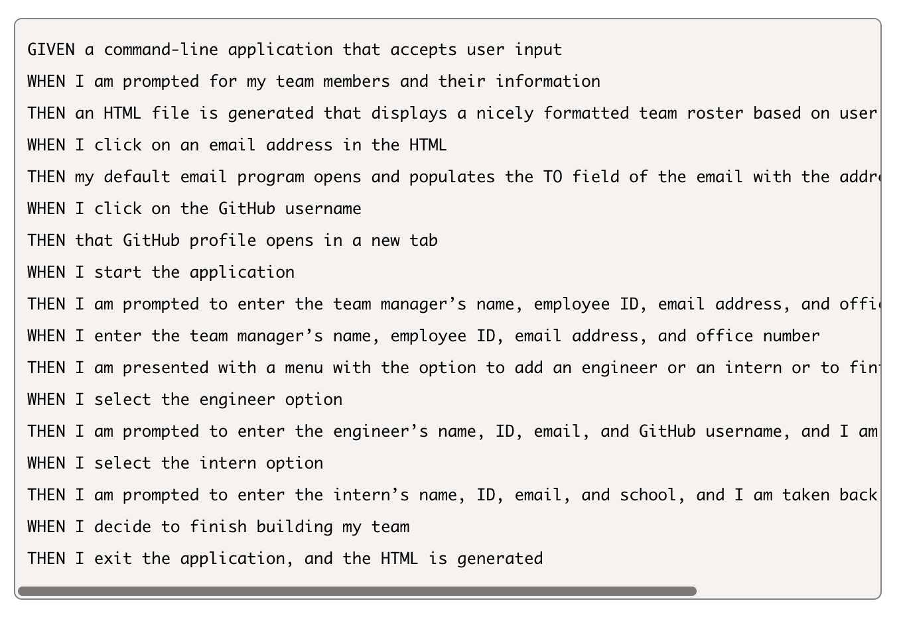

# Team Profile Generator

This project is a Node.js command-line application that takes in information about employees on a software engineering team and generates an HTML webpage that displays summaries for each person.

---

### **Steps to get started:**
```
- npm i
- node index.js
```
---

### **Application Acceptance Criteria:**


Link: [Generator Walkthrough Video](https://drive.google.com/file/d/1y6S0JN0MR-fX8vzLktl6851cRabGfC36/view)


---
### **Technology used:**
```
- Javascript
- Node.js
- Inquirer & Jest packages
```

---

### **Steps for future development:**
```
- successfully run generator
```